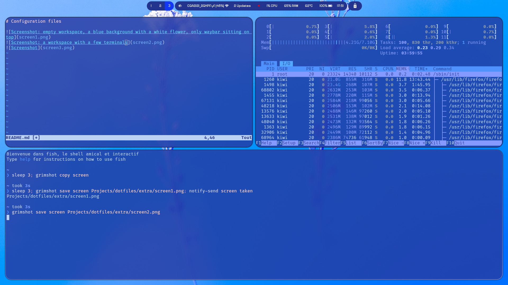
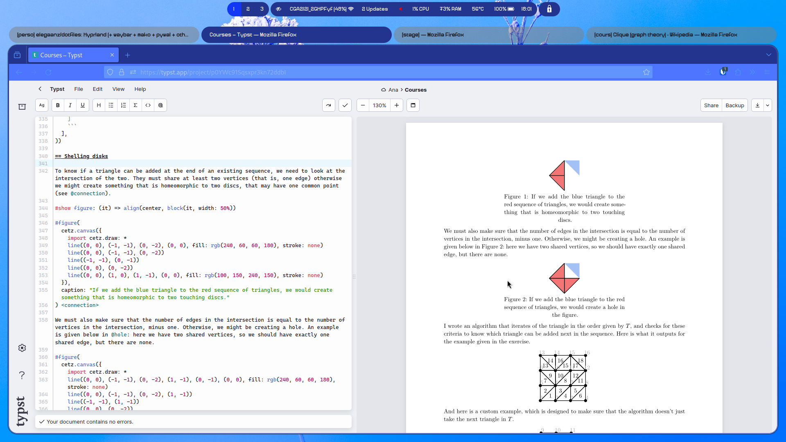

# Configuration files

This repository contains some my configuration files. I use **Hyprland**, along with the **hy3** plugin to get tabs. I installed **mako** to get notifications and **Waybar** to have a status bar. My terminal emulator is **Wezterm**.

The color scheme of the system and of most apps I use is controlled by **pywal**, and it changes accordingly to my wallpaper. I use the **Millimetre** font for the UI (the terminal uses the default Wezterm font, Jetbrains Mono).

Feel free to copy and adapt anything found here!

